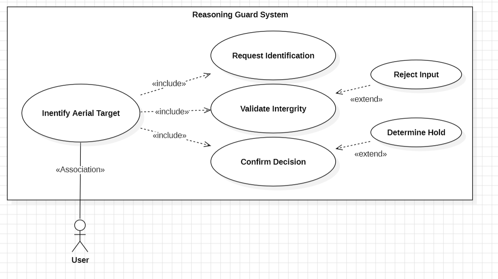
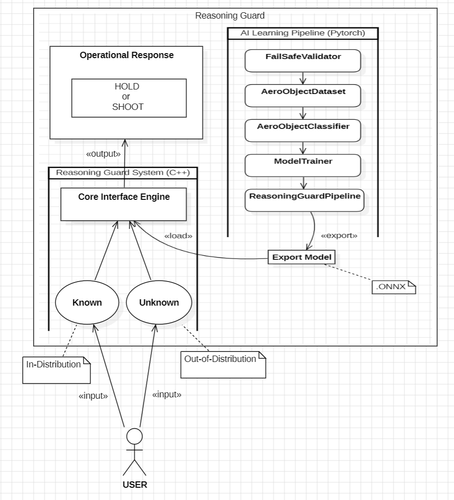

# Reasoning Guard

딥러닝 기반 미확인 공중 표적 정밀 판별 시스템

22212026 홍재원 hongjaewon0428@gmail.com

## Revision history
| Revision date | Vesrsion # | Description | Author |
| :---: | :---: | :---: | :---: |
| 03/17/2026 | 1.0.1 | 데이터셋 구축 | 홍재원 |
| 03/24/2026 | 1.0.2 | Zero-Padding 및 fail-Safe 설계 | 홍재원 |
| 03/30/2026 | 1.0.3 | ResNet-18모델 설계 및 지도학습 최적화 모듈 구축 | 홍재원 |
| 04/03/2026 | 1.0.4 | Reasoning Guard 총괄 파이프라인 구현 및 ONNX 추출 | 홍재원 |

## Contents

1. Introduction

2. Use case analysis  

3. Domain analysis 

4. User Interface prototype  

5. Glossary 

6. References 

 

---

## 1. Introduction

### 1) Summary
"전술 객체 식별의 신뢰성 확보 및 국방 Fail-safe 메커니즘의 구현", 본 시스템은 딥러닝 기반의 정밀 영상 분석과 기하학적 형상 보존 기술(**Zero-Padding**)을 결합하여, 단순 객체 탐지를 넘어 전장 노이즈에 의한 불확실성을 스스로 감지하는 **'Fail-safe' 메커니즘**을 탑재함.

* **핵심 가치:** 오발사로 인한 천문학적 손실을 원천 차단하는 국방 AI 핵심 기술 확보
* **기술 구현:** 엣지 컴퓨팅 환경에 즉시 이식 가능한 **C++ 기반 ONNX 추론 엔진** 구축
* **실효 검증:** 전술적 타당성 입증을 위한 **사용자 인터페이스(GUI) 기반 시뮬레이션 환경** 제공

 

### 2) Expandability
> **"온디바이스(On-device) 최적화를 통한 지능형 독립 유도 체계로의 고도화"**

실전 전장 환경의 급박한 **시계열 데이터**(**Time-series**)를 실시간으로 처리하기 위해, 연산 효율이 극대화된 **YOLO 계열의 객체 탐지 모델** 도입을 통해 시스템 고도화.

* **최적화 전략:** 미사일 탐색기 등 하드웨어 리소스가 극도로 제한된 환경에 맞춘 모델 경량화 및 양자화 기술 적용
* **미래 비전:** 외부 통신망 의존 없이 요격체 스스로 판단하는 **‘지능형 독립 유도(Intelligent Independent Guidance)’** 체계의 기술적 토대 마련

 

---

## 2. Use case analysis

#### Use Case #1: Identify Aerial Target (Root Process)

| GENERAL CHARACTERISTICS | 공중 표적 식별 (최상위 과정) |
| :--- | :--- |
| **Use Case Name** | **Identify Aerial Target** |
| **Summary** | 관제병이 시스템을 통해 미식별 공중 표적의 정체를 식별하고 교전 여부를 결정하는 통합 프로세스 |
| **Scope** | Reasoning Guard System |
| **Level** | User level (Main Goal) |
| **Primary Actor** | User (Operator / 관제병) |
| **Secondary Actor** | System (Reasoning Guard) |
| **Preconditions** | 시스템이 가동 중이며, 판독할 표적의 이미지 데이터가 확보된 상태임 |
| **Success Post Condition** | 유효한 데이터 검증을 거쳐 최종적인 SHOOT 또는 HOLD 결정을 도출함 |

| MAIN | SUCCESS SCENARIO  |
| :--- | :--- |
| **Step** | **Action** |
| 1 | 관제병이 시스템에 표적 식별을 요청함 (**Include: Request Identification**) |
| 2 | 시스템이 입력 데이터의 무결성을 확인하고 전처리를 수행함 (**Include: Validate Integrity**) |
| 3 | 시스템이 AI 추론을 통해 최종 판정 결과를 출력함 (**Include: Confirm Decision**) |

---

#### Use Case #2: Validate Integrity (with Fail-Safe Extension)

| GENERAL CHARACTERISTICS | 무결성 검증 (Fail-Safe 확장 포함) |
| :--- | :--- |
| **Use Case Name** | **Validate Integrity** |
| **Summary** | 입력된 이미지의 매직 넘버 및 픽셀 데이터를 검증하여 AI 모델 연산의 적합성을 판단 |
| **Scope** | Reasoning Guard System (FailSafeValidator) |
| **Level** | Sub-function level |
| **Primary Actor** | System (FailSafeValidator) |
| **Preconditions** | `Request Identification`을 통해 데이터가 메모리에 로드됨 |
| **Trigger** | 메인 프로세스(`Identify Aerial Target`)에서 데이터 검증 단계에 진입할 때 |
| **Success Post Condition** | 무결성이 확인된 데이터를 추론 엔진 규격(Tensor)으로 변환 완료 |

| MAIN | SUCCESS SCENARIO |
| :--- | :--- |
| **Step** | **Action** |
| 1 | `FailSafeValidator`가 파일 포맷 및 데이터 손상 여부를 2단계로 정밀 검사 |
| 2 | 정상 파일에 대해 원본 종횡비를 유지하는 **Zero-Padding** 전처리를 수행 |
| 3 | 전처리된 데이터를 추론 엔진용 다차원 Tensor로 변환하여 메모리에 할당 |

| EXTENSION SCENARIOS | |
| :--- | :--- |
| **Step** | **Branching Action** |
| 1 | **1a. Reject Input (Extend):** 데이터가 규격(png, jpg) 외 포맷이거나 심각하게 손상된 경우   1a1. 프로세스를 즉각 중단하고 사용자에게 경고 알림을 전송함 |

---

#### Use Case #3: Confirm Decision (with Uncertainty Extension)

| GENERAL CHARACTERISTICS | 결정 확인 (불확실성 확장 포함) |
| :--- | :--- |
| **Use Case Name** | **Confirm Decision** |
| **Summary** | ONNX 추론 엔진의 연산 결과를 바탕으로 표적의 정체를 확정하고 최종 교전 수칙을 UI에 시각화 |
| **Scope** | Reasoning Guard System (C++ Core Interface Engine) |
| **Level** | Sub-function level |
| **Primary Actor** | Inference Engine (ONNX Runtime) |
| **Secondary Actor** | User (Operator) |
| **Preconditions** | 무결성이 검증된 Tensor 데이터가 추론 엔진 입력 노드에 전달됨 |
| **Success Post Condition** | 높은 신뢰도로 식별된 객체에 대해 'SHOOT' 판정을 UI에 출력 |

| MAIN | SUCCESS SCENARIO |
| :--- | :--- |
| **Step** | **Action** |
| 1 | C++ 엔진이 ONNX 모델을 구동하여 객체의 클래스별 확률값을 산출 |
| 2 | 식별된 객체가 군사적 위협(미사일, 드론 등)이며 신뢰도가 임계치를 초과하는지 판단 |
| 3 | 최종 'SHOOT' 판정을 UI 화면에 텍스트로 즉각 렌더링함 |

| EXTENSION SCENARIOS | |
| :--- | :--- |
| **Step** | **Branching Action** |
| 2 | **2a. Determine Hold (Extend):** 객체의 식별 확률이 낮거나 데이터 분포 외 객체로 판단될 경우   2a1. 오발사 방지를 위해 강제로 'HOLD' 판정을 도출하여 사용자에게 알림 |

 

---

### 3. Domain analysis

본 프로젝트는 일반적인 사용자 상호작용(Use Case) 위주의 구현보다, 오발사 방지 및 실시간 추론을 위한 시스템적 아키텍처 설계 자체가 핵심적인 가치를 지님. 따라서 본 도메인 분석 단계에서는 단순 기능 중심의 접근을 넘어, Reasoning Guard 엔진을 실질적으로 구동하는 핵심 논리적 클래스(AI 학습 파이프라인 및 C++ 실시간 추론 엔진)들을 중점적으로 식별하여 나열함.

### Domain class description

| Class Name | Description |
| :--- | :--- |
| **User (Operator)** | 시스템을 조작하고 최종 교전 여부를 확인하는 관제병 클래스. 미확인 공중 표적(`Unknown Data`)을 시스템에 입력하고 최종 판단(`Operational Response`)을 수신 |
| **TargetData** | 관측 장비로부터 입력된 공중 객체의 이미지 및 메타 데이터를 담고 있는 클래스. 분포 내(In-Distribution) 데이터와 분포 외(Out-of-Distribution) 데이터를 모두 포함 |
| **FailSafeValidator** | `TargetData`의 무결성을 검증하는 보안 전처리 클래스. 실제 런타임 에러를 유발할 수 있는 파일 손상 여부 및 구조적 오류를 학습/추론 전에 원천 차단 |
| **AeroObjectDataset** | *(Offline Domain)* 검증된 이미지를 로드하여 원본 형상을 보존하기 위한 **Zero-Padding** 알고리즘을 적용하고, 데이터 증강 및 추론 가능한 Tensor 형태로 변환하는 데이터 공급 클래스 |
| **ModelTrainer** | *(Offline Domain)* PyTorch 환경에서 `AeroObjectClassifier`의 오차를 계산하고 가중치를 업데이트하는 지도학습 수행 및 최적화 관리 클래스. |
| **ReasoningGuardPipeline** | *(Offline Domain)* 데이터 검증, 데이터셋 분할, 모델 훈련(`ModelTrainer` 호출)부터 최종 ONNX 모델 추출까지 학습 파이프라인의 전체 프로세스를 통제하는 총괄 제어 클래스 |
| **InferenceEngine** | `.ONNX` 포맷으로 경량화된 AI 모델을 구동하는 핵심 추론 엔진 클래스. 객체의 종류(클래스)와 신뢰도(Confidence Score) 확률값을 연산하여 반환 |
| **CoreInterfaceEngine** | C++ 기반의 메인 제어 클래스로, 변환된 텐서 데이터를 `InferenceEngine`으로 전달하고 결과를 수집하여 최종 판단 로직을 조율 |
| **AeroObject** | 식별된 공중 객체의 속성(전투기, 드론, 로켓(미사일 대리))과 식별 확률 정보를 저장하는 엔티티 클래스 |
| **OperationalResponse** | `InferenceEngine`의 결과를 바탕으로 산출된 최종 교전 지침 클래스. 객체가 군사적 위협이고 신뢰도가 임계치를 넘으면 `SHOOT`, 불확실성이 크거나 비위협 객체일 경우 `HOLD` 상태값을 도출 |
