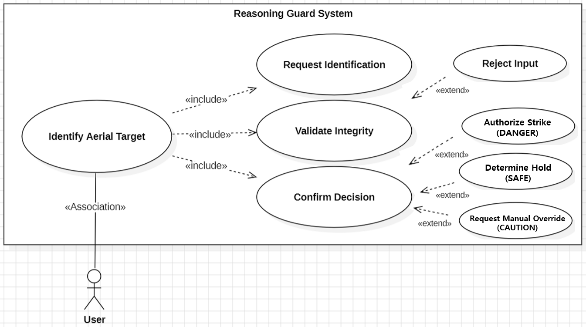
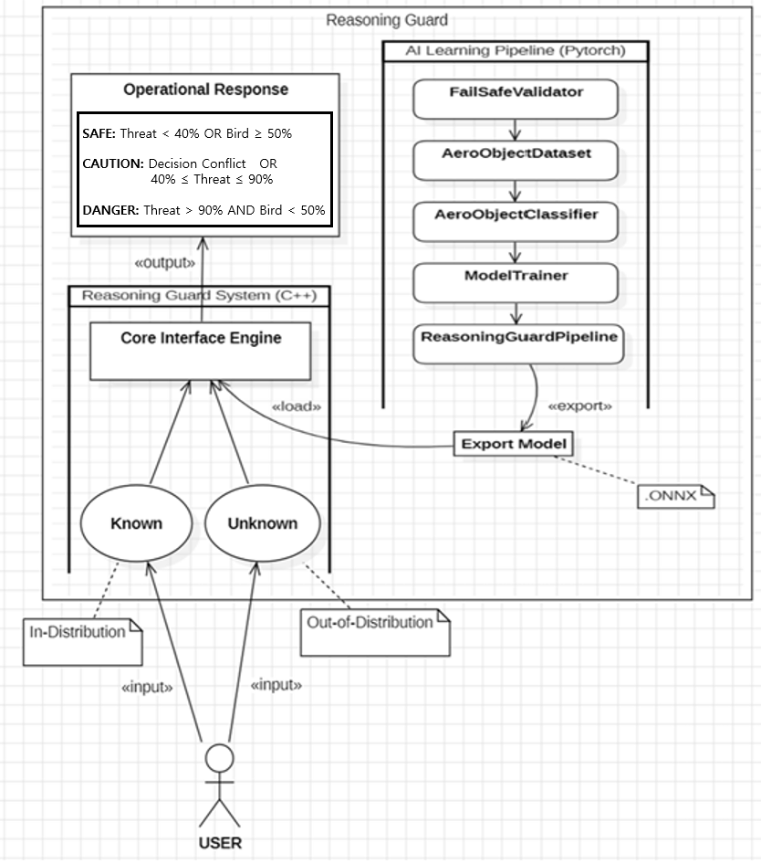
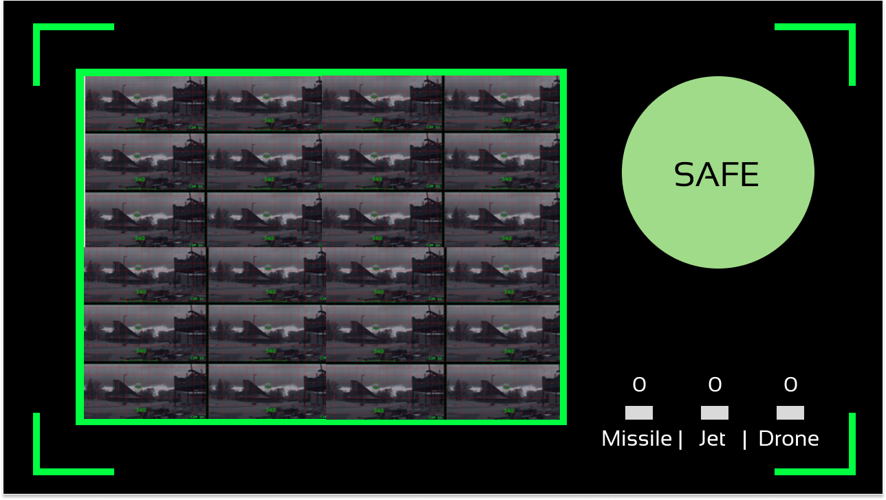
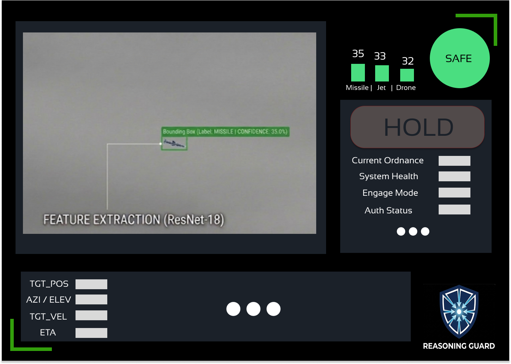
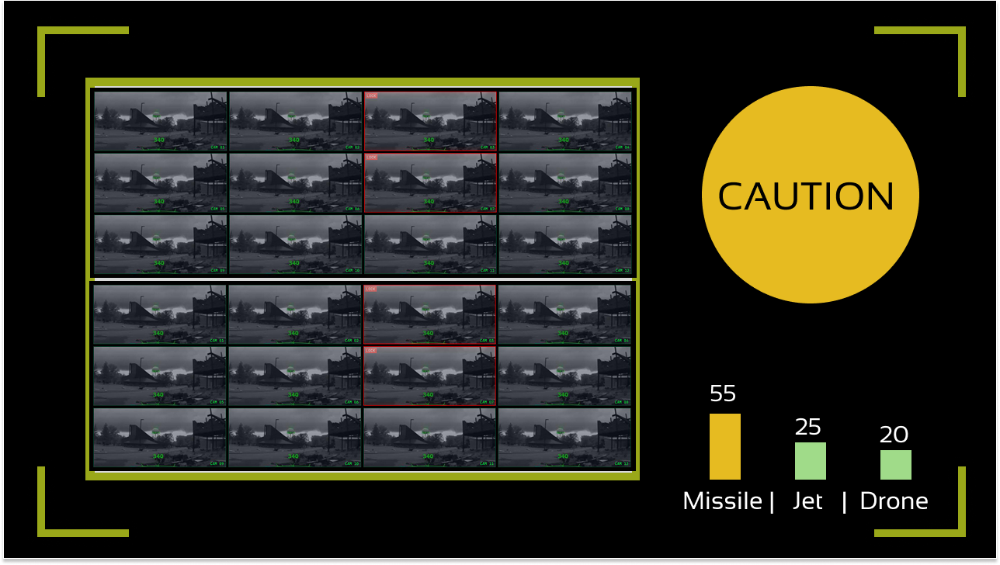
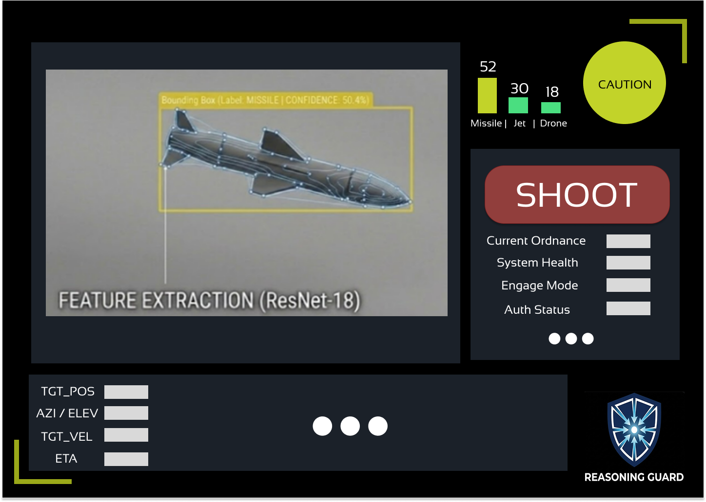
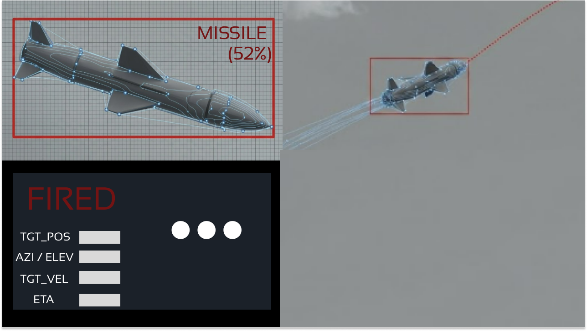
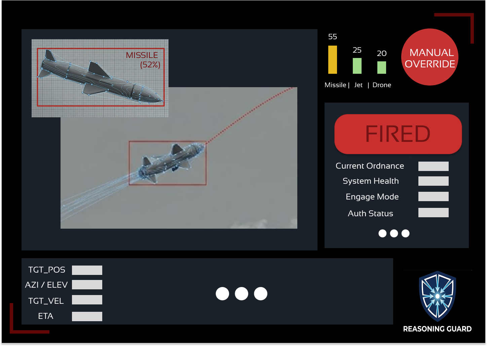
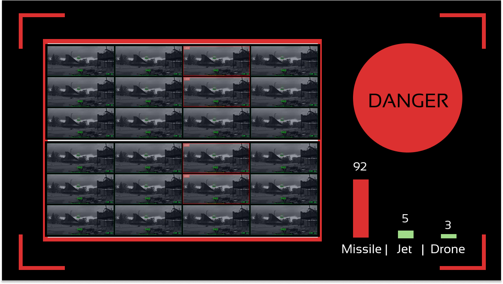
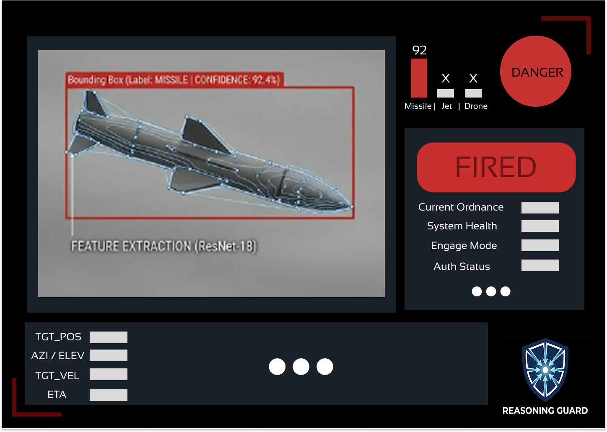

# Reasoning Guard

딥러닝 기반 미확인 공중 표적 정밀 판별 시스템

22212026 홍재원 hongjaewon0428@gmail.com

## Revision history

### Inference Engine
| Revision date | Version # | Description | Author |
| :---: | :---: | :---: | :---: |
| 03/17/2026 | 1.0.0 | 데이터셋 구축 | 홍재원 |
| 03/24/2026 | 1.0.1 | Zero-Padding 및 fail-Safe 설계 | 홍재원 |
| 03/30/2026 | 1.0.2 | ResNet-18모델 설계 및 지도학습 최적화 모듈 구축 | 홍재원 |
| 04/03/2026 | 1.0.3 | Reasoning Guard 총괄 파이프라인 구현 및 ONNX 추출 | 홍재원 |
| 04/30/2026 | 1.0.4 | 확률 도출 로직 추가 및 C++ 연동용 ONNX 엔진 업데이트 | 홍재원 |
| 05/03/2026 | 1.0.5 | 비정상 파일 유입 차단을 위한 확장자 필터링 적용 및 파이프라인 주석 정비 | 홍재원 |
| 05/10/2026 | 1.1.0 | 오사격 방지용 데이터 추가로 4개 클래스 확장   BCE 손실함수와 Sigmoid 다중 확률 추론 구조로 엔진 개편 및 실전 배포판 적용 | 홍재원 |

### Tactical Logic
| Revision date | Version # | Description | Author |
| :---: | :---: | :---: | :---: |
| 05/03/2026 | 1.0.0 | 이분법적 요격 판정을 신뢰도 기반 3단계 SAFE, CAUTION, DANGER 전술 대응 로직으로 세분화 | 홍재원 |
| 05/10/2026 | 1.1.0 | 오사격 방지 확률을 반영한 복합 조건문 도입   위협 객체와 비위협 객체의 확률 경합 상황을 고려하여 교전 통제 로직 고도화 | 홍재원 |

## Contents

1. Introduction

2. Use case analysis  

3. Domain analysis 

4. User Interface prototype  

5. Glossary 

6. References 

 

---

## 1. Introduction

### 1) Summary
"전술 객체 식별의 신뢰성 확보 및 국방 Fail-safe 메커니즘의 구현", 본 시스템은 딥러닝 기반의 정밀 영상 분석과 기하학적 형상 보존 기술(**Zero-Padding**)을 결합하여, 단순 객체 탐지를 넘어 전장 노이즈에 의한 불확실성을 스스로 감지하는 **'Fail-safe' 메커니즘**을 탑재함.

* **핵심 가치:** 오발사로 인한 천문학적 손실을 원천 차단하는 국방 AI 핵심 기술 확보
* **기술 구현:** 엣지 컴퓨팅 환경에 즉시 이식 가능한 **C++ 기반 ONNX 추론 엔진** 구축
* **실효 검증:** 전술적 타당성 입증을 위한 **사용자 인터페이스(GUI) 기반 시뮬레이션 환경** 제공

 

### 2) Expandability
> **"온디바이스(On-device) 최적화를 통한 지능형 독립 유도 체계로의 고도화"**

실전 전장 환경의 급박한 **시계열 데이터**(**Time-series**)를 실시간으로 처리하기 위해, 연산 효율이 극대화된 **YOLO 계열의 객체 탐지 모델** 도입을 통해 시스템 고도화.

* **최적화 전략:** 미사일 탐색기 등 하드웨어 리소스가 극도로 제한된 환경에 맞춘 모델 경량화 및 양자화 기술 적용
* **미래 비전:** 외부 통신망 의존 없이 요격체 스스로 판단하는 **‘지능형 독립 유도(Intelligent Independent Guidance)’** 체계의 기술적 토대 마련

 

---

## 2. Use case analysis

[그림 3] Use case diagram

 

#### Use Case #1: Identify Aerial Target (Root Process)

| GENERAL CHARACTERISTICS | 공중 표적 식별 (최상위 과정) |
| :--- | :--- |
| **Use Case Name** | **Identify Aerial Target** |
| **Summary** | 관제병이 시스템을 통해 미식별 공중 표적의 정체를 식별하고 교전 여부를 결정하는 통합 프로세스 |
| **Scope** | Reasoning Guard System |
| **Level** | User level (Main Goal) |
| **Primary Actor** | User (Operator / 관제병) |
| **Secondary Actor** | System (Reasoning Guard) |
| **Preconditions** | 시스템이 가동 중이며, 판독할 표적의 이미지 데이터가 확보된 상태임 |
| **Success Post Condition** | 유효한 데이터 검증을 거쳐 최종적인 SHOOT 또는 HOLD 결정을 도출함 |

| MAIN | SUCCESS SCENARIO  |
| :--- | :--- |
| **Step** | **Action** |
| 1 | 관제병이 시스템에 표적 식별을 요청함 (**Include: Request Identification**) |
| 2 | 시스템이 입력 데이터의 무결성을 확인하고 전처리를 수행함 (**Include: Validate Integrity**) |
| 3 | 시스템이 AI 추론을 통해 최종 판정 결과를 출력함 (**Include: Confirm Decision**) |

---

#### Use Case #2: Validate Integrity (with Fail-Safe Extension)

| GENERAL CHARACTERISTICS | 무결성 검증 (Fail-Safe 확장 포함) |
| :--- | :--- |
| **Use Case Name** | **Validate Integrity** |
| **Summary** | 입력된 이미지의 매직 넘버 및 픽셀 데이터를 검증하여 AI 모델 연산의 적합성을 판단 |
| **Scope** | Reasoning Guard System (FailSafeValidator) |
| **Level** | Sub-function level |
| **Primary Actor** | System (FailSafeValidator) |
| **Preconditions** | `Request Identification`을 통해 데이터가 메모리에 로드됨 |
| **Trigger** | 메인 프로세스(`Identify Aerial Target`)에서 데이터 검증 단계에 진입할 때 |
| **Success Post Condition** | 무결성이 확인된 데이터를 추론 엔진 규격(Tensor)으로 변환 완료 |

| MAIN | SUCCESS SCENARIO |
| :--- | :--- |
| **Step** | **Action** |
| 1 | `FailSafeValidator`가 파일 포맷 및 데이터 손상 여부를 2단계로 정밀 검사 |
| 2 | 정상 파일에 대해 원본 종횡비를 유지하는 **Zero-Padding** 전처리를 수행 |
| 3 | 전처리된 데이터를 추론 엔진용 다차원 Tensor로 변환하여 메모리에 할당 |

| EXTENSION SCENARIOS | |
| :--- | :--- |
| **Step** | **Branching Action** |
| 1 | **1a. Reject Input (Extend):** 데이터가 규격(png, jpg) 외 포맷이거나 심각하게 손상된 경우   1a1. 프로세스를 즉각 중단하고 사용자에게 경고 알림을 전송함 |

---

#### Use Case #3: Confirm Decision (with Uncertainty Extension)

| GENERAL CHARACTERISTICS | 결정 확인 (불확실성 확장 포함) |
| :--- | :--- |
| **Use Case Name** | **Confirm Decision** |
| **Summary** | ONNX 추론 엔진의 연산 결과를 바탕으로 표적의 정체를 확정하고 최종 교전 수칙을 UI에 시각화 |
| **Scope** | Reasoning Guard System (C++ Core Interface Engine) |
| **Level** | Sub-function level |
| **Primary Actor** | Inference Engine (ONNX Runtime) |
| **Secondary Actor** | User (Operator) |
| **Preconditions** | 무결성이 검증된 Tensor 데이터가 추론 엔진 입력 노드에 전달됨 |
| **Success Post Condition** | 도출된 신뢰도 임계치에 따라 SAFE / CAUTION / DANGER 상태를 분류하여 UI에 출력 |

| MAIN | SUCCESS SCENARIO |
| :--- | :--- |
| **Step** | **Action** |
| 1 | C++ 엔진이 ONNX 모델을 구동하여 객체의 클래스별 확률값을 산출 |
| 2 | 식별된 객체가 군사적 위협(미사일, 드론 등)이며 신뢰도가 임계치를 초과하는지 판단 |
| 3 | 위협 임계치(40% 이상) 충족 시 CAUTION 또는 DANGER 상태를 UI 화면에 즉각 렌더링 |

| EXTENSION SCENARIOS | |
| :--- | :--- |
| **Step** | **Branching Action** |
| 2 | **2a. Determine Hold (Extend):** 객체의 식별 확률이 낮거나 데이터 분포 외 객체로 판단될 경우   2a1. 오발사 방지를 위해 강제로 'SAFE(Hold)' 판정을 유지하고 관제병의 확인을 대기 |

 

---

## 3. Domain analysis

[그림 4] Reasoning Guard 시스템 도메인 모델

 

본 시스템은 국방 AI 엔진으로서 요구되는 고신뢰성 확보를 위해, 오발사 방지 메커니즘 및 실시간 추론 아키텍처의 정밀한 구축에 설계 역량을 집중함. 이에 따라 본 도메인 분석 단계에서는 시스템의 핵심 구동 원리를 명확히 반영하고자, Reasoning Guard 엔진을 구성하는 논리적 클래스들을 학습(PyTorch)과 운용(C++) 도메인으로 체계화하여 식별함.

### Domain class description

| Class Name | Domain | Description |
| :--- | :---: | :--- |
| **FailSafeValidator** | 학습 도메인 | 입력 데이터의 무결성을 검증하는 보안 전처리 클래스. 실제 런타임 에러를 유발할 수 있는 파일 손상 및 구조적 오류를 학습 전단계에서 원천 차단 |
| **AeroObjectDataset** | 학습 도메인 | 검증된 이미지를 로드하고 **Zero-Padding** 알고리즘을 적용하여 기하학적 형상을 보존 및 AI 연산용 Tensor 형태로 변환하여 공급 |
| **AeroObjectClassifier** | 학습 도메인 | ResNet-18 아키텍처를 기반으로 항공 표적의 선, 면, 실루엣 등 다차원 특징을 추출하는 심층 신경망 모델 클래스 |
| **ModelTrainer** | 학습 도메인 | 설정된 손실 함수와 최적화 알고리즘을 통해 모델의 가중치를 업데이트하며, 학습 및 검증 프로세스를 관리 |
| **ReasoningGuardPipeline** | 학습 도메인 | 데이터 분할부터 모델 훈련. 최종 ONNX 엔진 추출(Export)까지의 전체 학습 파이프라인을 제어하는 총괄 클래스 |
| **TargetData** | 운용 도메인 | 관측 장비로부터 유입된 실시간 공중 객체의 영상 이미지와 관련 메타 데이터(`Known`/`Unknown`)를 포함하는 데이터 객체 |
| **CoreInterfaceEngine** | 운용 도메인 | C++ 기반의 메인 컨트롤. 입력 데이터를 추론 엔진으로 전달하고 발생한 결과값을 수집하여 전체 판정 로직을 총괄 |
| **InferenceEngine** | 운용 도메인 | PyTorch에서 추출된 `.ONNX` 엔진을 로드하여 구동하며, 객체의 특징을 분석해 판별 신뢰도(Confidence Score)를 실시간으로 연산 |
| **OperationalResponse** | 운용 도메인 | 식별된 표적(전투기, 드론, 미사일(로켓))의 속성 및 확률 정보를 통합하여 전술적 지침으로 변환하는 최종 판정 클래스. 신뢰도 임계치에 따라 SAFE(평시 대기), CAUTION(수동 교전 승인), DANGER(자동 요격)의 3단계 전술 지침을 도출 |

 

---

## 4. User Interface prototype

본 시스템의 사용자 인터페이스는 전장의 다채널 카메라 입력을 실시간으로 종합하는 **거시적 관점의 '종합 전술 상황도(COP)'** 와, 단일 표적에 대한 AI 추론 결과를 시각화하는 **미시적 관점의 '사격 통제 제원(FCS) 인터페이스'** 두 가지 패널로 분리하여 구성됨.

특히, 추론 엔진이 도출한 확률(Confidence Score)에 따라 **SAFE(평시) ➔ CAUTION(경고) ➔ DANGER(교전)** 3단계로 이어지는 **단계별 대응(Tiered Response) 로직** 을 UI에 직관적으로 반영함. 이를 통해 관제병의 전술적 판단을 보조하고 오발사를 원천적으로 차단함.

**※ 인터페이스 데이터 연동 및 시스템 구현 범위 (Scope) 명시**
본 프로젝트의 핵심 목적은 딥러닝 비전 모델을 활용하여 표적을 정밀 식별하고, 도출된 확률값을 기반으로 3단계 전술 행동(HOLD, SHOOT, FIRED)을 결정하는 독립적인 '지능형 식별 엔진'의 구현임. 
따라서 사격 통제 제원 인터페이스(PC 화면) 상의 표적 위치(TGT_POS), 방위각/고각(AZI/ELEV) 및 아군 무장 상태(Current Ordnance) 등의 구체적인 물리적 수치 연산은 본 시스템의 구현 범위를 벗어남. 해당 영역(빈칸 및 원형 기호로 축약된 부분)은 실제 무기 체계 통합 시 외부 레이더 및 사격통제시스템(FCS)으로부터 수신받을 데이터 규격(Mock-up Data)을 정의해 둔 인터페이스 공간임. 모듈 간 결합도를 최소화하고 외부 연동 확장성을 확보하기 위해 시각적 프레임워크만 선제적으로 구축하였으며, 본 설계 범위에서 해당 변수들의 구체적인 연산 과정은 다루지 않음.

 

### 1) [SAFE 상태] 평시 모니터링 및 대기 단계

[그림 5]와 [그림 6]은 전장 내 특별한 위협이 없거나, 식별된 객체의 위협 확률이 임계치(40%) 미만일 때 출력되는 평시 상태의 UI임.

*
[그림 5] SAFE 상태: 종합 전술 상황도 (COP) 플랫폼
*

* 다채널 카메라 배열을 통해 전 구역을 모니터링하며, 전반적인 시스템 상태가 'SAFE'임을 녹색 UI로 표출함. 화면 우측 하단의 탐지 객체 카운트를 통해 현재 임박한 위협이 없음을 직관적으로 가시화함.

 

*
[그림 6] SAFE 상태: 전술 객체 정밀 식별 및 사격 통제 제원(FCS) 인터페이스
*

* 레이더에 미식별 객체가 포착되어 ResNet-18 기반의 특징 추출이 진행되었으나, 적대적 미사일일 확률(Confidence)이 35.0%로 낮게 측정된 상황임. 오발사 방지(Fail-safe) 메커니즘이 즉각 작동하여 최종 판정을 **'HOLD(대기)'** 로 도출하며, 녹색 바운딩 박스를 통해 현재 교전 대상이 아님을 관제병에게 통보함.

 

### 2) [CAUTION 상태] 위협 감지 및 교전 결심 단계

[그림 7]과 [그림 8]은 식별된 객체의 위협 확률이 경계 임계치(40% ~ 90%)에 도달했을 때 전환되는 위협 감지 상황의 UI임.

*
[그림 7] CAUTION 상태: 종합 전술 상황도 (COP) 플랫폼
*

* 특정 섹터의 카메라(CAM 03, 07 구역 등)에서 잠재적 위협이 감지되어 해당 구역을 붉은색으로 강조(LOCK)함. 전역 상태는 황색의 'CAUTION'으로 격상되며, 미사일 추정 객체의 탐지 카운트가 증가하여 지휘통제실의 주의를 즉각적으로 환기함.

 

*
[그림 8] CAUTION 상태: 전술 객체 정밀 식별 및 사격 통제 제원(FCS) 인터페이스
*

* 추론 결과 타겟이 미사일일 확률이 50.4%로 산출된 상황임. 노란색 바운딩 박스로 표적을 정밀 추적하며, 시스템은 교전 권고 상태인 **'SHOOT(사격)'** 판정을 도출함. 이때 외부 사격 통제 제원 인터페이스와 아군 가용 무장 현황 패널이 연동 활성화되어, 관제병이 즉각적인 교전 승인 의사결정을 내릴 수 있도록 전술 데이터를 시각적으로 지원함.

* ★ **[CRITICAL POINT: USER(관제병)의 실질적 개입이 이루어지는 유일한 단계]** CAUTION 상태는 관제병의 능동적 전술 통제가 개입되는 핵심 구간임. 'SHOOT'버튼으로 활성화되며, 오발사 방지를 위한 2중 안전장치로서 '수동 교전 승인' 인터페이스(안전장치 해제 토글 및 최종 승인 버튼)로 구현함. 관제병이 식별 정보 및 제원을 최종 확인하고 승인(ARM)을 인가해야만 실제 무장 체계로 타격 데이터가 인계되도록 설계하여 시스템에 대한 인간 통제력(Human Control)을 완벽히 보장함.

 

 

*
[그림 9] CAUTION 상태 (수동 개입): 종합 전술 상황도 (COP) TV 인터페이스
*

* 관제병이 PC 화면에서 수동 교전을 승인(Manual Override)함에 따라, 지휘통제실의 TV 화면 역시 해당 표적에 대한 요격 프로세스를 즉각적으로 브로드캐스팅함.
* **화면 분할(PIP, Picture-in-Picture)** UI를 적용하여 좌측 상단에는 표적의 정밀 식별 영상(근접 샷)을, 배경에는 표적의 예측 비행 궤도 및 요격 동선을 동시에 시각화함으로써 지휘부의 거시적인 전술 상황 파악 능력을 극대화함.

 

*
[그림 10] CAUTION 상태 (수동 개입): 사격 통제 제원(FCS) PC 인터페이스
*

* 관제병의 능동적 개입으로 타격이 인가되면, 우측 상단의 경고 지시기가 **'MANUAL OVERRIDE'** 로 전환되며 현재 교전 제어권이 시스템(AI)에서 인간으로 전환되었음을 명시적으로 표출함.
* 수동 교전 승인 절차가 완료됨과 동시에 중앙의 교전 버튼이 붉은색의 **'FIRED(발사)'** 상태로 활성화되며, AI가 분석한 타격 제원이 실제 외부 무장 체계로 성공적으로 인계되었음을 관제병에게 직관적으로 피드백함.

### 3) [DANGER 상태] 위협 확정 및 교전 실행 단계

[그림 11]과 [그림 12]는 객체의 위협 확률이 자동 교전 임계치(90% 이상)를 초과하여, 찰나의 지연 없이 즉각적인 타격이 요구되는 상황의 UI임.

*
[그림 11] DANGER 상태: 종합 전술 상황도 (COP) 플랫폼
*

* 고위협 표적의 쇄도가 시스템적으로 확정됨에 따라 화면 전반에 적색의 'DANGER' 경보가 점등됨. 이는 방공망 전체가 최고 수준의 비상 상태로 전환되었음을 의미함.

 

*
[그림 12] DANGER 상태: 전술 객체 정밀 식별 및 사격 통제 제원(FCS) 인터페이스
*

* 객체가 미사일일 확률이 92.4%로 확정된 초근접 혹은 고위협 상황임. 표적을 적색 바운딩 박스로 락온(Lock-on)함과 동시에 최종 판정이 **'FIRED(발사)'** 로 전환됨. 이는 시계열적으로 매우 짧은 대응 시간 내에 인간의 인지 및 승인 지연을 극복하기 위해, 식별 엔진이 산출된 데이터를 바탕으로 무장 시스템에 자동 타격 명령을 하달했음을 나타냄.

 

## 5. Glossary

| 용어 | 설명 |
| :--- | :--- |
| **Reasoning Guard** | 본 프로젝트에서 개발하는 딥러닝 기반 미확인 공중 표적 정밀 판별 시스템의 명칭 |
| **Fail-safe (페일 세이프)** | 데이터 손상이나 전장 노이즈 등의 불확실성 감지 시, 오발사를 방지하고 시스템을 안전한 상태(HOLD)로 강제 유지하는 안전 메커니즘 |
| **Zero-Padding (제로 패딩)** | 이미지 전처리 과정에서 원본 표적 데이터의 종횡비와 기하학적 형상을 왜곡 없이 보존하기 위해 이미지 외곽에 0(여백)을 채우는 기술 |
| **ONNX (Open Neural Network Exchange)** | 다양한 AI 프레임워크 간의 호환을 돕는 개방형 포맷. PyTorch에서 학습된 모델을 C++ 기반 운용 환경(엣지 디바이스)에 경량화하여 배포하기 위해 사용됨 |
| **ResNet-18** | 항공 표적의 선, 면, 실루엣 등 다차원 시각적 특징을 빠르고 정확하게 추출하기 위해 본 시스템에 채택된 심층 신경망(CNN) 아키텍처 |
| **Confidence Score (신뢰도)** | AI 추론 엔진이 분석한 객체가 특정 클래스(미사일, 드론, 전투기 등)에 속할 확률값 |
| **COP (종합 전술 상황도)** | Common Operational Picture. 다채널 카메라 입력을 실시간으로 종합하여 전장의 전체적인 상황을 거시적으로 보여주는 모니터링 인터페이스 |
| **FCS (사격 통제 제원)** | Fire Control System. 특정 단일 표적에 대한 AI 추론 결과(신뢰도, 제원 등)를 시각화하고 직접적인 타격을 제어하는 미시적 관점의 인터페이스 |
| **Manual Override** | 자동화된 AI 시스템의 제어 권한을 일시적으로 무효화하고, 관제병(Operator)이 수동으로 개입하여 최종 타격 승인(ARM)을 통제하는 과정 |
| **PIP (Picture-in-Picture)** | 주 화면(배경) 위에 보조 화면(작은 창)을 겹쳐서 띄우는 UI 기법. 표적의 원거리 궤도 예측과 근접 정밀 영상을 동시에 제공하기 위해 사용 |

 

## 6. References
* UI 프로토타입 시각 에셋(Asset)  
  - 사격 통제 제원(FCS) 내 표적(미사일) 시뮬레이션 이미지 : Google Gemini (Generative AI)를 활용하여 자체 제작
* 캐글(Kaggle) 데이터셋 출처  
  - 전투기 데이터셋 : https://www.kaggle.com/datasets/jrmymimran/fighterjets  
  - 드론 데이터셋 : https://www.kaggle.com/datasets/dasmehdixtr/drone-dataset-uav  
  - 로켓(미사일 대리) 데이터셋 : https://www.kaggle.com/datasets/eneskosar19/rocket-dataset-for-image-detection-labelled  
