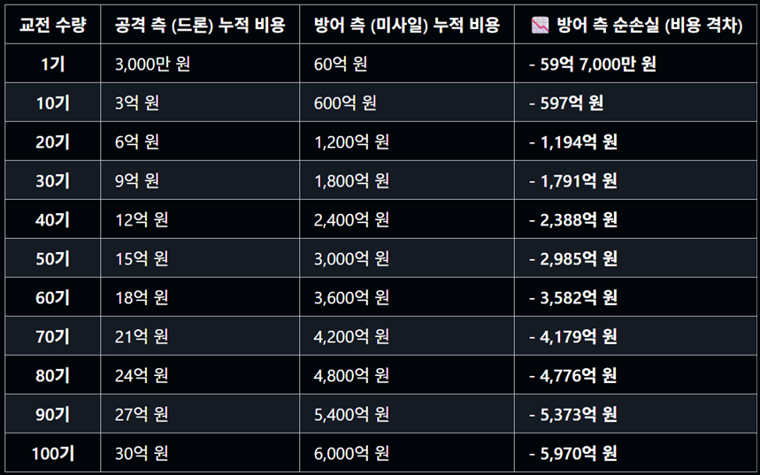
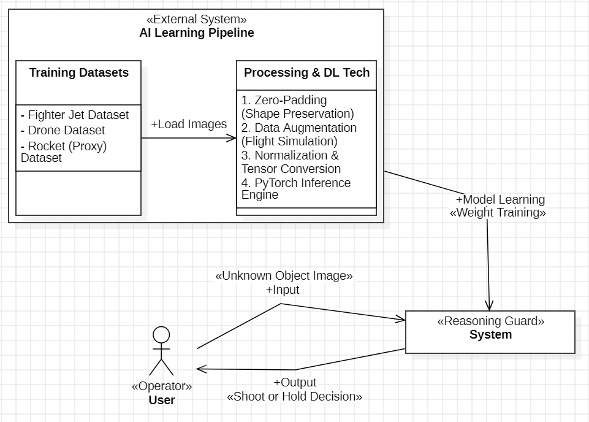

# Reasoning Guard
딥러닝 기반 미확인 공중 표적 정밀 판별 시스템

22212026 홍재원 hongjaewon0428@gmail.com

## Revision history
| Revision date | Vesrsion # | Description | Author |
| :--- | :--- | :--- | :--- |
| 03/13/2026 | 0.00 | First Concept document | 홍재원 |

## Contents
1. Business purpose 

2. System context diagram 

3. Use case list 

4. Concept of operation  

5. Problem statement 

6. Glossary 

7. References 

 

---

## 1. Business Purpose
**1) Project background**

[그림 1] 연합뉴스, 2026.03.03 기준 - 군집 위협 규모에 따른 방어 측 재정적 손해 누적 추이 

 

 위 [그림 1]에서 볼 수 있듯, 단 100기의 드론이 쇄도하는 군집 공습 상황만 가정해도 방어 측은 순식간에 약 6000억 원의 재정적 손실을 입게 되는 극단적인 소모전 양상에 직면함. 이러한 비용 비대칭성 속에서, 최근 중동 지역에서 발생한 대규모 공습 사례처럼, 현대전은 저비용 드론과 고성능 미사일을 혼용하여 방공망을 교란하는 공중 위협이 주된 양상으로 자리 잡음. 특히 수백 개의 드론과 미사일이 동시에 쇄도하는 상황에서 인간 관제병의 판단만으로는 한계가 있으며, 아군기와 적기를 순식간에 오판하여 발생할 수 있는 오발사 위험이 비약적으로 증가하고 있음. 단 한 번의 오인 사격은 수십억 원에 달하는 요격 미사일의 낭비를 넘어, 방어막 공백으로 인한 핵심 방공 기지 및 군사 인프라 파괴로 이어져 수천억 원 단위의 천문학적인 2차 피해를 초래함. 이에 따라 딥러닝 기반의 CV 기술을 활용하여 공중 객체의 정체를 정밀하게 식별하고, 요격 여부에 대한 ‘시각적 추론’을 제공하는 고신뢰성 SW 엔진이 절대적으로 필요하다고 판단함.

**2) goal**

본 프로젝트의 최종 목표는 PyTorch 기반의 딥러닝 모델을 활용하여 공중 객체 (미사일, 전투기, 드론)을 탐지하고 요격 의사결정을 지원하는 ‘Reasoning Guard : 오발사 방지형 실시간 공중 객체 식별 시스템’을 객체 지향 원칙(OOP)에 입각하여 설계 및 구현하는 것임.
* **형상 보존형 전처리 파이프라인**  
  Zero-Padding 기법을 도입하여, 고속 비행 객체 고유의 종횡비를 엄격히 보존함. 이는 리사이징 과정에서의 형상 왜곡을 방지하여 모델의 특징 추출 성능과 식별 정확도를 극대화하는 핵심 파이프라인이 됨.

* **UI 통합형 고신뢰성 의사결정 로직**  
  학습된 모델을 바탕으로 요격 대상(전투기, 미사일, 드론)에 포함된다면 Shoot(사격)을, 이외의 객체들이면 Hold(대기)라는 판정 결과를 직관적인 UI를 통해 즉각 제공하는 의사결정 알고리즘을 구축함.

* **객체 지향적 모듈화 설계**  
  시스템의 유지 보수성과 확장성을 위해 모델 추론, 영상 전처리, UI 제어, 이벤트 로그 관리 등 각 기능을 철저히 모듈화함. 

* **대리 객체를 통한 데이터 제약 극복**  
  국방 데이터의 보안성 및 가용성을 고려하여, 실제 미사일과 기하학적 형태가 유사한 로켓 데이터셋을 대리 객체로 활용함. 이를 통해 데이터 획득의 한계를 극복할 예정임.

**3) Target Market**
* 대한민국 국방부 및 방위산업체
* 방공 부대 및 전략 거점
* 미래형 무인 요격 체제

 

---

## 2. System Context Diagram Labels

[그림 2] System context diagram

 

* Fighter Jet / Drone / Rocket (Proxy) Dataset : 전투기 / 드론 / 로켓(대리) 데이터셋
* Zero-Padding (Shape Preservation) : 제로 패딩 (형상 보존)
* Data Augmentation (Flight Simulation) : 데이터 증강 (비행 환경 모사)
* Normalization & Tensor Conversion : 정규화 및 텐서 변환
* PyTorch Inference Engine : 파이토치 추론 엔진
* Model Learning (Weight Training) : 모델 학습 (가중치 훈련)
* System (Reasoning Guard) : 시스템 (Reasoning Guard)
* Input (Unknown Object Image) : 입력 (미식별 객체 이미지)
* Output (Shoot or Hold Decision) : 출력 (사격 또는 대기 결정)
* User (Operator) : 사용자 (관제병)

 

---

## 3. Use case list

### 1) 미식별 공중 객체 이미지 판독 요청
| Category | Details |
| :---: | :--- |
| **Actor** | User (관제병) |
| **Description** | 관제병이 레이더나 카메라 망에 포착된 미식별 공중 객체의 원본 이미지 파일을 시스템에 업로드하여 정체 판독을 요청함 |

### 2) 비정상 입력 데이터 차단 (Fail-safe 검증)
| Category | Details |
| :---: | :--- |
| **Actor** | System (Reasoning Guard) |
| **Description** | 데이터가 입력되면, 추론 엔진 가동 전 시스템이 파일의 구조를 자체 분석하여 이미지 외의 악성/오류 데이터를 즉각 차단함 |

### 3) 형상 보존형 Tensor 전처리 (Zero-Padding)
| Category | Details |
| :---: | :--- |
| **Actor** | System (Reasoning Guard) |
| **Description** | 무결성이 검증된 이미지에 대해, 객체 비율 왜곡을 막기 위한 패딩 처리를 수행하고 AI 연산용 다차원 Tensor로 변환함 |

### 4) ONNX 기반 실시간 객체 추론 (CNN 연산)
| Category | Details |
| :---: | :--- |
| **Actor** | Inference Engine (추론 엔진) |
| **Description** | 전처리된 Tensor 데이터를 바탕으로, C++ 환경에 최적화된 ONNX 모델이 다차원 특징을 추출하여 고가치 타격 대상일 확률값을 계산함 |

### 5) 사격/대기(Shoot/Hold) 최종 판정 및 출력
| Category | Details |
| :---: | :--- |
| **Actor** | User (관제병) |
| **Description** | 시스템이 연산된 확률값을 바탕으로 요격(Shoot) 또는 대기(Hold) 결과를 도출하면, 관제병은 UI에 출력된 결과를 확인하여 전술적 행동을 취함 |

### 6) 도메인 적응형 AI 모델 백그라운드 업데이트
| Category | Details |
| :---: | :--- |
| **Actor** | AI Learning Pipeline (외부 학습 시스템) |
| **Description** | 전장 환경의 도메인 차이를 극복하기 위해, 데이터 증강이 적용된 최신 가중치 파일을 외부 파이프라인이 운영 시스템에 지속적으로 동기화함 |

 

---
## 4. Concept of Operation

### 1) 미식별 공중 객체 이미지 판독 요청
| Category | Details |
| :---: | :--- |
| **Purpose** | 관제병이 판독을 의뢰할 객체의 시각적 원본(이미지) 데이터를 추론 파이프라인의 시작점으로 전달 |
| **Approach** | 사용자가 UI를 통해 미식별 객체의 프레임(이미지)을 시스템에 업로드함 |
| **Dynamics** | 업로드된 해당 이미지(레이더에 식별된 이미지)의 객체가 요격 대상(전투기, 미사일, 드론)인지 AI의 정밀한 시각적 식별이 필요할 때 |
| **Goals** | 신속하고 오류 없는 이미지 데이터 입력을 통해 실시간 시각적 추론 파이프라인을 가동함 |

### 2) 비정상 입력 데이터 차단 (Fail-safe 검증)
| Category | Details |
| :---: | :--- |
| **Purpose** | 비정상 파일 유입으로 인한 치명적인 런타임 에러 및 시스템 셧다운 사전 방지 |
| **Approach** | 사용자의 입력 직후, 단순 확장자 검사를 넘어선 파일 매직 넘버 검증 로직이 가동. 문서 파일이나 손상된 데이터일 경우 엔진 진입 전 원천 차단(Fail-safe)함 |
| **Dynamics** | 시스템 메모리에 데이터가 로드되기 직전, 데이터의 무결성을 검증하는 단계 |
| **Goals** | 군사 시스템에 필수적인 무중단 가용성을 확보하고, 오판을 야기할 수 있는 노이즈 입력을 차단함 |

### 3) 형상 보존형 Tensor 전처리 (Zero-Padding)
| Category | Details |
| :---: | :--- |
| **Purpose** | AI 모델의 인식률 저하를 방지하기 위한 규격화된 정밀 입력 데이터 생성 |
| **Approach** | 이미지 리사이징 시 발생하는 공중 객체의 공기역학적 실루엣 훼손을 막기 위해 Zero-Padding을 적용함. 픽셀 정규화 후, 모델 연산에 즉각 투입 가능한 다차원 Tensor로 변환함 |
| **Dynamics** | 데이터 무결성 검증이 통과되어 추론 엔진에 들어가기 직전의 내부 백그라운드 연산 단계 |
| **Goals** | 객체의 기하학적 형태를 온전히 보존하여 CNN 모델의 특징 추출 정확도를 극대화함 |

### 4) ONNX 기반 실시간 객체 추론 (CNN 연산)
| Category | Details |
| :---: | :--- |
| **Purpose** | 고속 비행 표적에 대응하기 위한 실시간 객체 식별 및 확률 연산 수행 |
| **Approach** | 파이토치 인터프리터의 지연을 해결하기 위해 사전 변환된 ONNX 구조의 추론 엔진을 가동함. 내부의 다차원 CNN 필터가 객체의 본질적인 형태를 식별하고 각 클래스별 타격 확률값을 정밀하게 산출함 |
| **Dynamics** | 처리가 완료된 Tensor 데이터가 엔진의 입력 노드로 전달되어 연산이 시작될 때 |
| **Goals** | 전술적으로 허용 가능한 최소한의 지연 시간 내에 고차원 특징 추출을 완수함 |

### 5) 사격/대기(Shoot/Hold) 최종 판정 및 출력
| Category | Details |
| :---: | :--- |
| **Purpose** | 복잡한 내부 연산 확률값을 관제병이 직관적으로 이해할 수 있는 단일 행동 지침으로 변환 |
| **Approach** | 추론 엔진이 산출한 결과가 전투기, 드론, 미사일에 해당하면 ‘Shoot’을, 그 외 불확실한 타겟은 ‘Hold’ 상태를 도출함. 프런트엔드는 추가적인 그래픽 렌더링 없이 이 텍스트 결과만을 즉시 시각화함 |
| **Dynamics** | 엔진의 확률값 연산이 완료되어 최종 의사결정 로직을 통과했을 때 |
| **Goals** | 관제병의 인지 부하를 최소화하고, 긴급 교전 상황에서 오인 사격을 방지하는 명확한 판단 근거를 제공함 |

### 6) 도메인 적응형 AI 모델 백그라운드 업데이트
| Category | Details |
| :---: | :--- |
| **Purpose** | 실전 환경(Domain Shift)과의 괴리를 줄이고 방공망 식별 신뢰도를 영구적으로 유지 |
| **Approach** | 외부 학습 파이프라인에서 모션 블러 및 환경 노이즈 삽입 등 데이터 증강 기법을 적용해 훈련을 수행함. 최적화된 가중치 파일은 운영 시스템의 런타임 간섭 없이 백그라운드에 덮어씀 |
| **Dynamics** | 외부 시스템의 학습 Epoch가 종료되어 성능 개선이 확인된 새로운 가중치가 배포될 때 |
| **Goals** | 지속적인 모델 강건성 확보를 통해 시스템의 생존성과 타격 정확도를 극대화함 |

 

---

## 5. Problem Statement

**Overview**
* [수정필요]

 

---

## 6. Glossary

| Terms | Description |
| :--- | :--- |
| **Zero-Padding (제로 패딩)** | 객체의 고유한 종횡비(비율) 왜곡을 방지하기 위해 빈 공간을 검은 여백으로 채우는 전처리 기법 |
| **Data Augmentation (데이터 증강)** | 기상의 변화나 다양한 비행 각도 등의 환경을 모사하여 모델의 강건성을 높이는 기법 |
| **Tensor (텐서)** | 파이토치(PyTorch) 딥러닝 엔진이 영상 데이터를 빠르고 효율적으로 연산하기 위해 사용하는 다차원 배열 데이터 구조 |
| **Proxy Dataset (대리 데이터셋)** | 보안상 구하기 힘든 실제 국방 데이터 대신, 형태가 유사한 로켓 등의 이미지로 구성한 학습용 대체 데이터셋 |

 

---

## 7. References
* 국방 비용 비대칭성 관련 뉴스 [그림 1] : https://www.yna.co.kr/view/AKR20260303027500009
* 기술적 근거 : 2025.20087v1 (엔비디아 논문) : https://arxiv.org/abs/2505.20087
* 캐글(Kaggle) 데이터셋 출처  
  - 전투기 데이터셋 : https://www.kaggle.com/datasets/jrmymimran/fighterjets  
  - 드론 데이터셋 : https://www.kaggle.com/datasets/dasmehdixtr/drone-dataset-uav  
  - 로켓(미사일 대리) 데이터셋 : https://www.kaggle.com/datasets/eneskosar19/rocket-dataset-for-image-detection-labelled  
