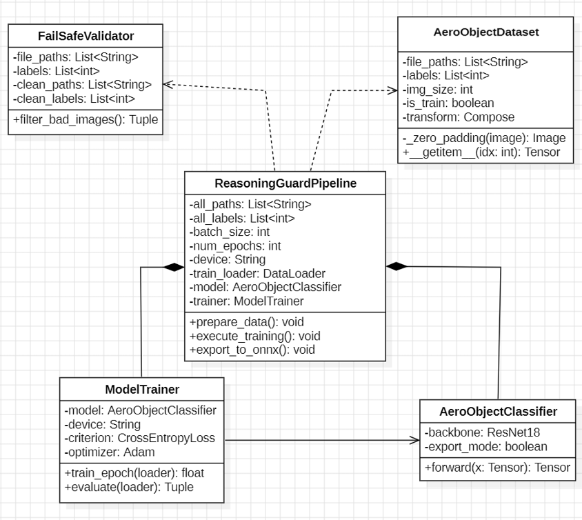

# Reasoning Guard

딥러닝 기반 미확인 공중 표적 정밀 판별 시스템

22212026 홍재원 hongjaewon0428@gmail.com

## Revision history

### Inference Engine
| Revision date | Version # | Description | Author |
| :---: | :---: | :---: | :---: |
| 03/17/2026 | 1.0.1 | 데이터셋 구축 | 홍재원 |
| 03/24/2026 | 1.0.2 | Zero-Padding 및 fail-Safe 설계 | 홍재원 |
| 03/30/2026 | 1.0.3 | ResNet-18모델 설계 및 지도학습 최적화 모듈 구축 | 홍재원 |
| 04/03/2026 | 1.0.4 | Reasoning Guard 총괄 파이프라인 구현 및 ONNX 추출 | 홍재원 |
| 04/30/2026 | 1.0.5 | 확률 도출 로직 추가 및 C++ 연동용 ONNX 엔진 업데이트 | 홍재원 |
| 05/03/2026 | 1.0.6 | 비정상 파일 유입 차단을 위한 확장자 필터링 적용 및 파이프라인 주석 정비(최종) | 홍재원 |

### Tactical Logic
| Revision date | Version # | Description | Author |
| :---: | :---: | :---: | :---: |
| 05/03/2026 | 1.0 | 이분법적 요격 판정(Shoot/Hold)을 신뢰도 기반 3단계   (SAFE/CAUTION/DANGER) 전술 대응 로직으로 세분화 | 홍재원 |

## Contents

1. Introduction

2. Class Diagram  

3. Sequence Diagram 

4. State Machine Diagram 

5. Implementation Requirements 

6. Glossary

7. References

 

---

## 1. Introduction

본 설계서는 딥러닝 기반 미확인 공중 표적 정밀 판별 시스템인 "Reasoning Guard" 개발 프로세스의 제3단계 상세 설계(Design) 명세를 기술함. 선행된 Analysis 단계의 요구사항을 바탕으로 실제 시스템 구현에 관여하는 물리적·논리적 제반 요소의 윤곽을 확정하고 구체적인 아키텍처 설계를 수립함을 목적으로 함. 본 시스템은 단순 객체 탐지 알고리즘의 한계를 탈피하여 정밀 영상 분석 및 기하학적 형상 보존 기술(Zero-Padding)을 융합함으로써, 전장 노이즈에 기인한 불확실성을 능동적으로 감지하는 'Fail-safe' 메커니즘의 구현을 핵심 설계 원칙으로 함. 학습 도메인에서는 Python 및 PyTorch 기반의 객체 지향 모델 아키텍처를 구축하며, 도출된 신경망은 ONNX 포맷 변환을 거쳐 운용 도메인인 C++ 기반 고속 추론 엔진 환경에 최적화 탑재됨. 이를 통해 극한의 실시간 시계열 데이터 환경하에서도 표적 식별의 신뢰성을 확보하고, 궁극적으로 오발사 리스크 차단 및 국방 방공망 운용의 안정성 극대화를 도모함.

 

---

## 2. Class Diagram

### 2.1 학습(Training) 관점 클래스

**(1) ReasoningGuardPipeline**
* **설명**: 전체 학습 파이프라인을 총괄하며 데이터 검증, 분할, 모델 학습 및 ONNX 추출까지의 전 과정을 제어함.
* **Attributes (속성)**
  * `- all_paths: List<string>` : 전체 이미지 파일 경로 리스트
  * `- all_labels: List<int>` : 각 데이터에 대응하는 클래스 라벨
  * `- batch_size: int` : 학습 시 배치 크기
  * `- num_epochs: int` : 학습 반복 횟수
  * `- device: string` : 연산 장치(CPU/GPU)
  * `- train_loader: DataLoader` : 학습 데이터 로더
  * `- val_loader: DataLoader` : 검증 데이터 로더
  * `- model: AeroObjectClassifier` : 학습 대상 모델
  * `- trainer: ModelTrainer` : 학습 수행 객체
* **Operations (메서드)**
  * `+ prepare_data(): void` : Fail-safe 검증 후 학습/검증 데이터 분할 및 로딩
  * `+ execute_training(): void` : 모델 학습 및 성능 평가 수행
  * `+ export_to_onnx(): void` : 학습된 모델을 ONNX로 변환

**(2) FailSafeValidator**
* **설명**: 입력 이미지의 파일 구조 및 픽셀 데이터를 검증하여 손상된 데이터를 사전에 제거하는 무결성 검증 모듈임.
* **Attributes (속성)**
  * `- file_paths: List<string>` : 전체 파일 경로 리스트
  * `- labels: List<int>` : 각 데이터의 라벨
  * `- clean_paths: List<string>` : 검증 완료된 정상 파일 경로
  * `- clean_labels: List<int>` : 검증 완료된 라벨
* **Operations (메서드)**
  * `+ filter_bad_images(): Tuple` : 손상된 이미지를 제거하고 정상 데이터만 반환

**(3) AeroObjectDataset**
* **설명**: 검증된 이미지 데이터를 로드하고 Zero-Padding 및 데이터 증강을 적용하여 모델 입력용 Tensor로 변환하는 데이터셋 클래스임.
* **Attributes (속성)**
  * `- file_paths: List<string>` : 이미지 파일 경로
  * `- labels: List<int>` : 클래스 라벨
  * `- img_size: int` : 모델 입력 이미지 크기 (224)
  * `- is_train: boolean` : 학습/검증 모드 여부
  * `- transform: Compose` : 데이터 증강 및 정규화 파이프라인
* **Operations (메서드)**
  * `+ _zero_padding(image): Image` : 종횡비 보존을 위한 패딩 수행
  * `+ __getitem__(idx): Tensor` : 데이터 로딩 및 Tensor 반환

**(4) ModelTrainer**
* **설명**: 손실 함수와 최적화 알고리즘을 기반으로 모델을 학습하고 성능을 평가하는 클래스임.
* **Attributes (속성)**
  * `- model: AeroObjectClassifier` : 학습 대상 모델
  * `- device: string` : 연산 장치
  * `- criterion: CrossEntropyLoss` : 손실 함수
  * `- optimizer: Adam` : 최적화 알고리즘
* **Operations (메서드)**
  * `+ train_epoch(loader): float` : 1 epoch 학습 수행 및 평균 loss 반환
  * `+ evaluate(loader): Tuple` : 검증 데이터에 대한 loss 및 accuracy 반환

**(5) AeroObjectClassifier**
* **설명**: ResNet-18 기반으로 항공 객체의 특징을 추출하고 클래스별 확률을 예측하는 딥러닝 모델임.
* **Attributes (속성)**
  * `- backbone: ResNet18` : 특징 추출 CNN 모델
  * `- export_mode: boolean` : ONNX 추출 시 Softmax 활성화 여부
* **Operations (메서드)**
  * `+ forward(x: Tensor): Tensor` : 입력 이미지에 대한 추론 수행

---

### 2.2 운용(Operational) 관점 클래스

**(1) CoreInterfaceEngine**
* **설명**: 전체 운용 시스템의 중심 제어 모듈로, 입력 데이터 처리 → 추론 → 전술 판단까지의 흐름을 통합 관리함.
* **Attributes (속성)**
  * `- inferenceEngine: IEngine` : 추론 엔진 인터페이스
  * `- opResponse: OperationalResponse` : 전술 판단 객체
  * `- is_system_ready: bool` : 시스템 준비 상태
* **Operations (메서드)**
  * `+ processTarget(data: TargetData): void` : 입력 데이터 처리 및 추론 실행
  * `+ collectResult(): float` : 추론 결과(Confidence Score) 수집
  * `+ executeLogic(): void` : 전술 판단 로직 수행

**(2) IEngine**
* **설명**: 다양한 추론 엔진 구현을 추상화하기 위한 인터페이스로, 공통 추론 함수 계약을 정의함.
* **Attributes (속성)**
  * (없음 - 인터페이스)
* **Operations (메서드)**
  * `+ runInference(tensor): float` : 입력 텐서에 대한 추론 결과 반환

**(3) OnnxEngine**
* **설명**: ONNX Runtime 기반으로 경량화된 추론을 수행하는 실제 구현 클래스임.
* **Attributes (속성)**
  * `- onnx_model: Session` : ONNX 모델 세션
  * `- env: Env` : 실행 환경 설정
* **Operations (메서드)**
  * `+ runInference(tensor): float` : 입력 데이터를 기반으로 확률값 반환

**(4) OperationalResponse**
* **설명**: 추론된 신뢰도를 기반으로 전술 상태(SAFE/CAUTION/DANGER)를 판단하고 행동을 결정하는 클래스임.
* **Attributes (속성)**
  * `- current_state: string` : 현재 전술 상태
  * `- danger_threshold: float` : DANGER 판정 임계값 (예: 90%)
  * `- caution_threshold: float` : CAUTION 판정 임계값 (예: 40%)
* **Operations (메서드)**
  * `+ evaluateThreat(score: float): string` : 신뢰도를 기반으로 상태 결정
  * `+ executeAction(): void` : 상태에 따른 대응 수행
  * `+ getState(): string` : 현재 상태 반환

**(5) TargetData**
* **설명**: 관측 장비로부터 입력되는 원본 이미지 및 메타데이터를 포함하는 데이터 객체임.
* **Attributes (속성)**
  * `- raw_image: Mat` : 원본 이미지 데이터
  * `- metadata: string` : 부가 정보 (시간, 위치 등)
* **Operations (메서드)**
  * `+ getRawImage(): Mat` : 이미지 데이터 반환
  * `+ getMetadata(): string` : 메타데이터 반환

 

---

## 3. Sequence Diagram
