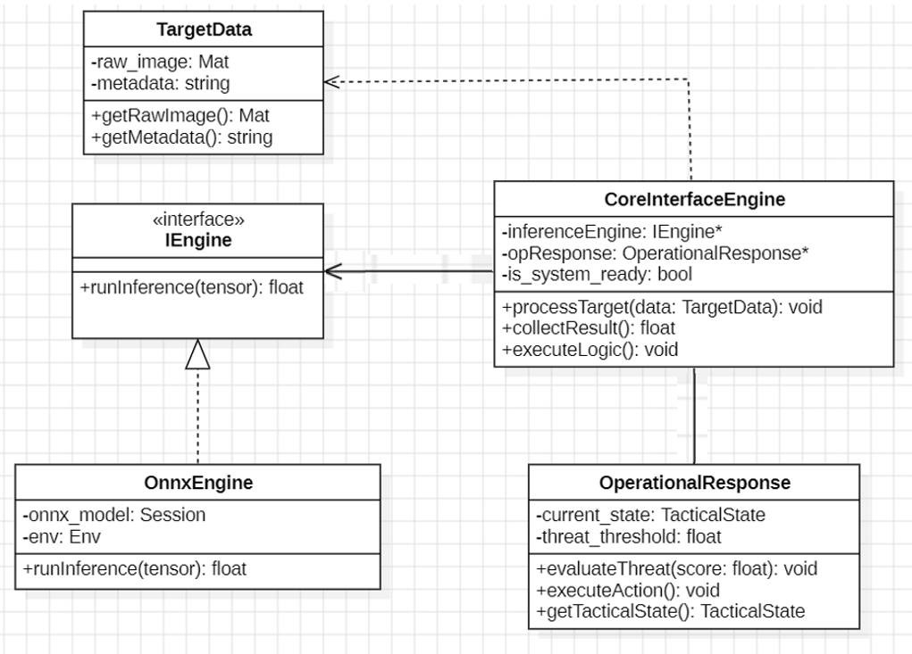
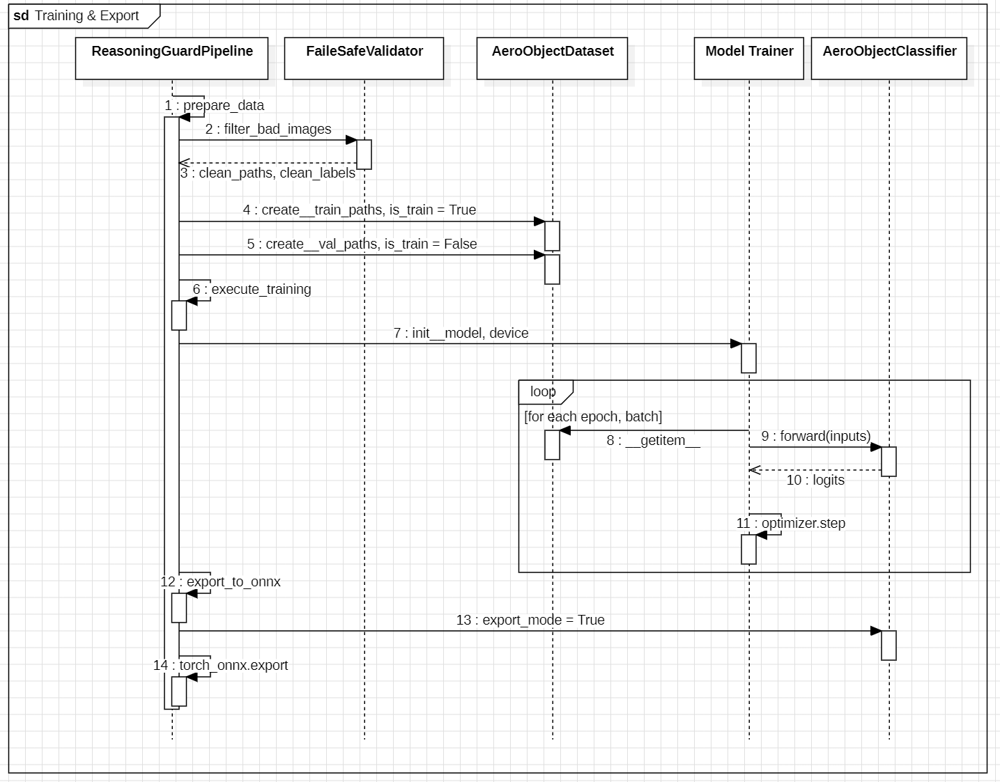
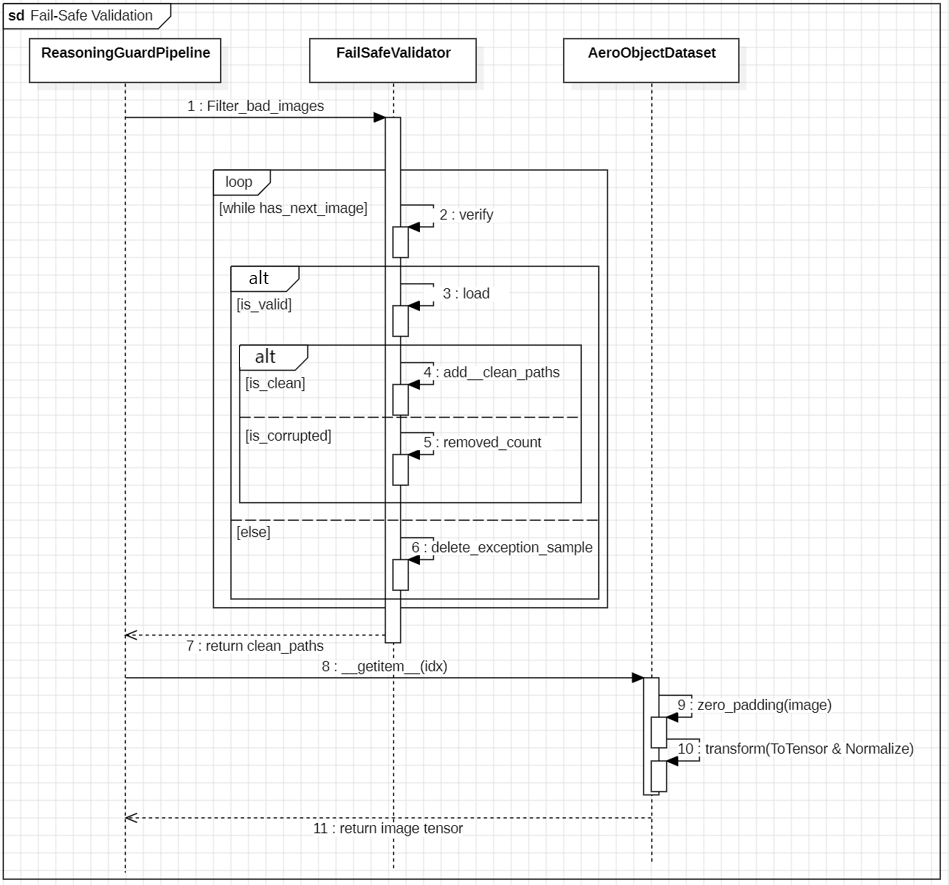
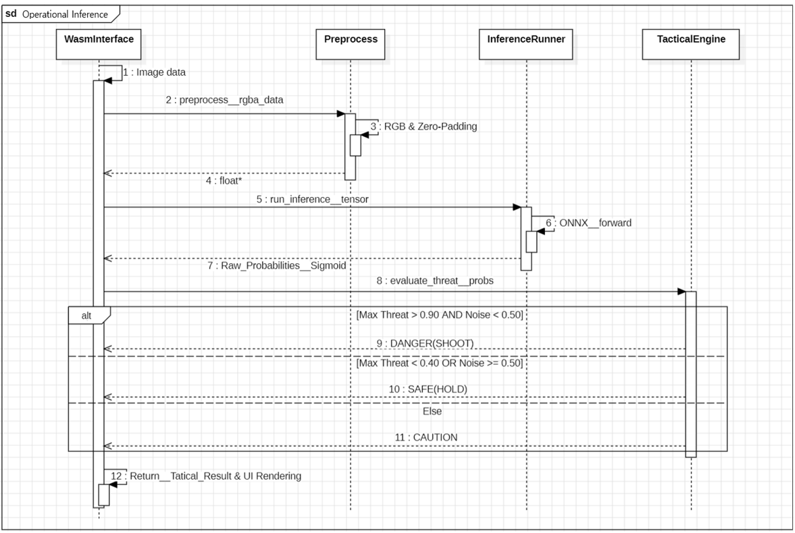
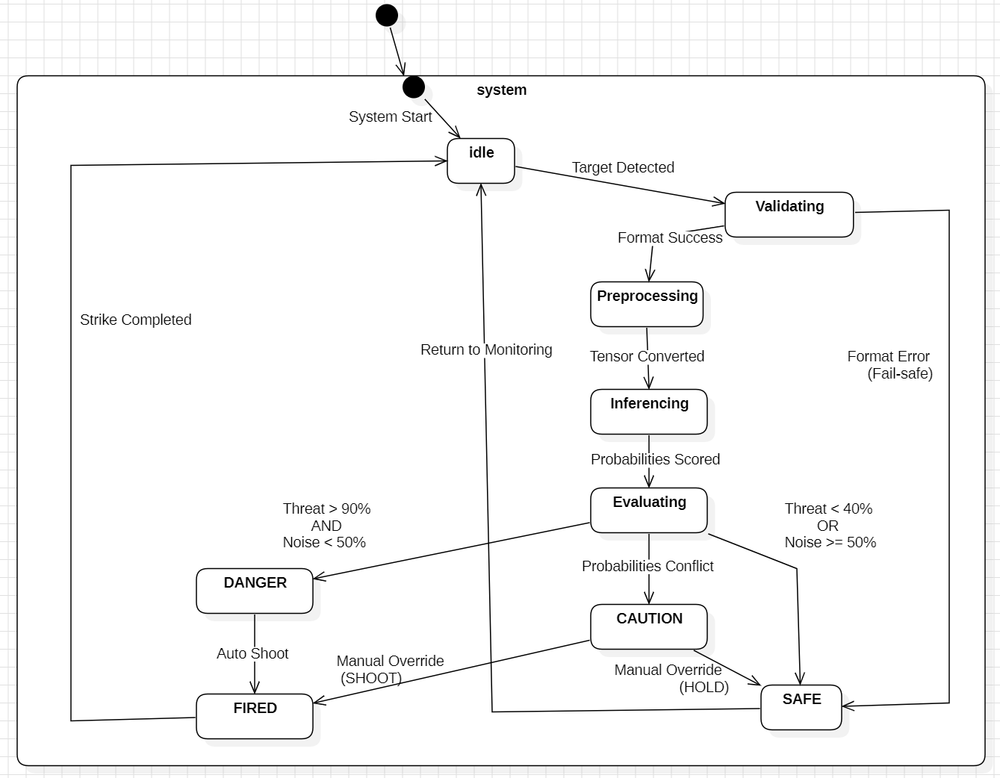

# Reasoning Guard

딥러닝 기반 미확인 공중 표적 정밀 판별 시스템

22212026 홍재원 hongjaewon0428@gmail.com

## Revision history

### Inference Engine
| Revision date | Version # | Description | Author |
| :---: | :---: | :---: | :---: |
| 03/17/2026 | 1.0.0 | 데이터셋 구축 | 홍재원 |
| 03/24/2026 | 1.0.1 | Zero-Padding 및 fail-Safe 설계 | 홍재원 |
| 03/30/2026 | 1.0.2 | ResNet-18모델 설계 및 지도학습 최적화 모듈 구축 | 홍재원 |
| 04/03/2026 | 1.0.3 | Reasoning Guard 총괄 파이프라인 구현 및 ONNX 추출 | 홍재원 |
| 04/30/2026 | 1.0.4 | 확률 도출 로직 추가 및 C++ 연동용 ONNX 엔진 업데이트 | 홍재원 |
| 05/03/2026 | 1.0.5 | 비정상 파일 유입 차단을 위한 확장자 필터링 적용 및 파이프라인 주석 정비 | 홍재원 |
| 05/10/2026 | 1.1.0 | 오사격 방지용 데이터 추가로 4개 클래스 확장   BCE 손실함수와 Sigmoid 다중 확률 추론 구조로 엔진 개편 및 실전 배포판 적용 | 홍재원 |

### Tactical Logic
| Revision date | Version # | Description | Author |
| :---: | :---: | :---: | :---: |
| 05/03/2026 | 1.0 | 이분법적 요격 판정을 신뢰도 기반 3단계 SAFE, CAUTION, DANGER 전술 대응 로직으로 세분화 | 홍재원 |
| 05/10/2026 | 1.1 | 오사격 방지 확률을 반영한 복합 조건문 도입   위협 객체와 비위협 객체의 확률 경합 상황을 고려하여 교전 통제 로직 고도화 | 홍재원 |

## Contents

1. Introduction

2. Class Diagram  

3. Sequence Diagram 

4. State Machine Diagram 

5. Implementation Requirements 

6. Glossary

7. References

 

---

## 1. Introduction

Reasoning Guard System은 딥러닝(PyTorch) 기반으로 학습된 미확인 공중 표적(Fighter, Drone, Missile 등) 식별 모델을 C++ 및 WebAssembly(WASM) 기반의 전술 엔진으로 포팅하여, 실시간 고성능 추론을 제공하는 지능형 방공 솔루션임.

본 설계 문서는 AI 모델의 학습 과정(학습 관점)과, 학습이 완료된 모델(ONNX)이 네이티브 C++ 환경 및 웹 브라우저 환경에서 실제 운용되는 시스템 아키텍처 및 클래스 설계(운용 관점)를 정의함. 본 시스템의 핵심 목표는 기존의 무거운 Python 서버 의존성을 탈피하고, Edge Device(임베디드) 및 클라이언트(웹 브라우저) 단에서 지연 없는 즉각적인 전술 판단을 수행하는 데 있음.

 

---

## 2. Class Diagram

### 2.1 학습(Training) 관점 클래스

**(1) ReasoningGuardPipeline**
* **설명**: 전체 학습 파이프라인을 총괄하며 데이터 검증, 분할, 모델 학습 및 ONNX 추출까지의 전 과정을 제어함.
* **Attributes (속성)**
  * `- all_paths: List<string>` : 전체 이미지 파일 경로 리스트
  * `- all_labels: List<int>` : 각 데이터에 대응하는 클래스 라벨
  * `- batch_size: int` : 학습 시 배치 크기
  * `- num_epochs: int` : 학습 반복 횟수
  * `- device: string` : 연산 장치(CPU/GPU)
  * `- train_loader: DataLoader` : 학습 데이터 로더
  * `- val_loader: DataLoader` : 검증 데이터 로더
  * `- model: AeroObjectClassifier` : 학습 대상 모델
  * `- trainer: ModelTrainer` : 학습 수행 객체
* **Operations (메서드)**
  * `+ prepare_data(): void` : Fail-safe 검증 후 학습/검증 데이터 분할 및 로딩
  * `+ execute_training(): void` : 모델 학습 및 성능 평가 수행
  * `+ export_to_onnx(): void` : 학습된 모델을 ONNX로 변환

**(2) FailSafeValidator**
* **설명**: 입력 이미지의 파일 구조 및 픽셀 데이터를 검증하여 손상된 데이터를 사전에 제거하는 무결성 검증 모듈임.
* **Attributes (속성)**
  * `- file_paths: List<string>` : 전체 파일 경로 리스트
  * `- labels: List<int>` : 각 데이터의 라벨
  * `- clean_paths: List<string>` : 검증 완료된 정상 파일 경로
  * `- clean_labels: List<int>` : 검증 완료된 라벨
* **Operations (메서드)**
  * `+ filter_bad_images(): Tuple_List_String_List_int` : 손상된 이미지를 제거하고 정상 데이터만 반환

**(3) AeroObjectDataset**
* **설명**: 검증된 이미지 데이터를 로드하고 Zero-Padding 및 데이터 증강을 적용하여 모델 입력용 Tensor로 변환하는 데이터셋 클래스임.
* **Attributes (속성)**
  * `- file_paths: List<string>` : 이미지 파일 경로
  * `- labels: List<int>` : 클래스 라벨
  * `- img_size: int` : 모델 입력 이미지 크기 (224)
  * `- is_train: boolean` : 학습/검증 모드 여부
  * `- transform: Compose` : 데이터 증강 및 정규화 파이프라인
* **Operations (메서드)**
  * `+ _zero_padding(image): Image` : 종횡비 보존을 위한 패딩 수행
  * `+ __getitem__(idx): Tensor` : 데이터 로딩 및 Tensor 반환

**(4) ModelTrainer**
* **설명**: 손실 함수와 최적화 알고리즘을 기반으로 모델을 학습하고 성능을 평가하는 클래스임.
* **Attributes (속성)**
  * `- model: AeroObjectClassifier` : 학습 대상 모델
  * `- device: string` : 연산 장치
  * `- criterion: CrossEntropyLoss` : 손실 함수
  * `- optimizer: Adam` : 최적화 알고리즘
* **Operations (메서드)**
  * `+ train_epoch(in loader:DataLoader): float` : 1 epoch 학습 수행 및 평균 loss 반환
  * `+ evaluate(in loader:DataLoader): Tuple_float_float` : 검증 데이터에 대한 loss 및 accuracy 반환

**(5) AeroObjectClassifier**
* **설명**: ResNet-18 기반으로 항공 객체의 특징을 추출하고 클래스별 확률을 예측하는 딥러닝 모델임.
* **Attributes (속성)**
  * `- backbone: ResNet18` : 특징 추출 CNN 모델
  * `- export_mode: boolean` : ONNX 추출 시 Softmax 활성화 여부
* **Operations (메서드)**
  * `+ forward(x: Tensor): Tensor` : 입력 이미지에 대한 추론 수행

---

### 2.2 운용(Operational) 관점 클래스

운용 관점 클래스는 학습된 ONNX 모델을 실제 환경(네이티브 C++ 및 웹 브라우저)에 임베딩하여 고속으로 추론하고 전술적 판단을 내리는 실행 엔진의 구조를 정의함.

### (1) Preprocess (데이터 전처리 모듈)
* **설명**: 파일 시스템이나 웹 브라우저(Canvas)로부터 입력받은 원본 이미지 데이터를 AI 모델이 처리할 수 있는 정규화된 1차원 텐서(CHW 포맷)로 변환함. 고성능 출력을 위해 C++ 환경에서 BGR 변환, Zero-Padding, 리사이즈 및 ImageNet 정규화를 직접 수행함.
* **관련 파일**: `preprocess.h`, `tactical_wasm.cpp`
* **Attributes (속성)**
    * `- TARGET_SIZE: int` : 모델 입력 이미지의 규격 (224)
    * `- MEAN: float[3]` : ImageNet 정규화를 위한 채널별 평균값 (0.485, 0.456, 0.406)
    * `- STD: float[3]` : ImageNet 정규화를 위한 채널별 표준편차 (0.229, 0.224, 0.225)
* **Operations (메서드)**
    * `+ preprocess(img_path: string): vector<float>` : (Native) OpenCV를 활용하여 원본 이미지를 로드하고 모델 입력용 정규화 텐서로 변환
    * `+ preprocess(rgba_data: byte*, width: int, height: int): float*` : (WASM) 순수 C++ 연산을 통해 브라우저의 픽셀 데이터를 정규화 텐서 배열로 변환
    * `- bilinear_resize(src: const unsigned char*, srcW: int, srcH: int, dst: unsigned char*, dstW: int, dstH: int, channels: int): void` : (내부 함수) OpenCV 종속성 없이 이미지 크기 조정 수행

### (2) InferenceRunner (추론 실행 모듈)
* **설명**: ONNX Runtime(ORT) C++ API를 직접 제어하여 메모리에 모델을 로드하고, 전처리된 텐서를 주입하여 원시 점수(Raw Score)를 산출하는 코어 제어부임. 
* **관련 파일**: `main.cpp`
* **Attributes (속성)**
    * `- session: Ort::Session` : 최적화 레벨이 적용된 추론 세션 인스턴스
    * `- env: Ort::Env` : ONNX 실행 환경 및 로깅 설정 객체
    * `- memory_info: Ort::MemoryInfo` : 텐서 메모리 할당 정보
* **Operations (메서드)**
    * `+ init_session(model_path: string): void` : 모델 파일 로드 및 세션 옵션(스레드, 그래프 최적화 등) 초기화
    * `+ run_inference(input_tensor: float[]): float[]` : 입력 텐서를 모델에 통과시켜 클래스별 원시 확률(sigmoid) 배열 반환

### (3) TacticalEngine (전술 판단 모듈)
* **설명**: AI가 도출한 4개 클래스(FIGHTER, DRONE, MISSILE, ETC)의 확률값을 기반으로 실제 교전 지침에 따른 위협 상태(DANGER / CAUTION / SAFE)를 판정하는 유틸리티임.
* **관련 파일**: `tactical_engine.h`, `tactical_wasm.cpp`
* **Attributes (속성)**
    * `- CLASS_NAMES: string[4]` : 판별 대상 클래스명 (FIGHTER, DRONE, MISSILE, ETC)
    * `- DANGER_THRESHOLD: float` : 타격 인가 최대 확률 임계값 (0.90)
    * `- NOISE_THRESHOLD: float` : 노이즈(ETC) 허용 최대 임계값 (0.50)
    * `- CAUTION_THRESHOLD: float` : 주의 단계 확률 임계값 (0.40)
* **Operations (메서드)**
    * `+ evaluate_threat(probs: float[4]): TacticalResult` : 설정된 임계값 조건에 따라 원시 확률값을 평가하여 최종 전술 상태 및 식별 결과 결정

### (4) WasmInterface (웹 어셈블리 브릿지)
* **설명**: C++로 작성된 고성능 전처리 및 전술 엔진을 브라우저(JavaScript)에서 직접 호출할 수 있도록 메모리를 공유하고 WebAssembly 인터페이스를 노출하는 브릿지임.
* **관련 파일**: `tactical_wasm.cpp`
* **Attributes (속성)**
    * `- g_tensor: float[]` : JS 환경과 공유되는 전처리 완료 이미지 텐서 전역 버퍼
    * `- g_result: TacticalResultWasm` : JS 환경과 공유되는 전술 판정 결과 전역 구조체
* **Operations (메서드)**
    * `+ get_tensor_size(): int` : JS에서 Float32Array 메모리를 할당하기 위한 텐서 버퍼 크기 반환
    * `+ evaluate_threat(probs: float*): TacticalResultWasm*` : JS(ONNX Runtime Web)에서 넘겨받은 확률 배열을 C++ 엔진으로 평가한 후 결과 구조체 포인터 반환

---

## 3. Sequence Diagram

### 학습 파이프라인 가동 및 ONNX 추출 

본 다이어그램은 개발자(Developer)가 모델 학습을 지시했을 때 가동되는 내부 파이프라인의 흐름을 도식화함. ReasoningGuardPipeline이 전체 흐름을 총괄하며, FailSafeValidator를 호출하여 비정상 이미지를 필터링한 후 AeroObjectDataset을 생성함. 
이후 ModelTrainer를 통해 설정된 반복 횟수(Epoch)만큼 배치를 로드하고, AeroObjectClassifier에서 순전파(forward) 및 역전파(backward) 연산을 수행하여 모델의 가중치를 업데이트함. 학습이 완료되면 실전 운용을 위해 가중치를 .onnx 포맷으로 추출(Export)하여 최종 반환함.

 

### 무결성 검증

본 다이어그램은 비정상 파일 유입으로 인한 런타임 에러를 원천 차단하기 위한 무결성 검증 및 전처리 과정을 나타냄. 시스템(System)이 데이터를 로드할 때 FailSafeValidator가 모든 이미지 파일에 대해 구조 포맷 검사(verify)와 실제 픽셀 손상 검사(load)를 2중으로 수행함.
검증을 통과한 정상 데이터의 경로만 반환되며, 이후 AeroObjectDataset이 원본 종횡비를 보존하는 제로 패딩(Zero-padding)과 정규화를 거쳐 추론 엔진이 인식할 수 있는 다차원 텐서(Tensor) 형태로 변환하여 반환함.

 

### 실시간 추론 및 전술 판정

본 다이어그램은 실제 전장 상황에서 관제병(User)이 미식별 표적의 판독을 요청했을 때 가동되는 C++ 및 WebAssembly 기반의 실시간 추론 흐름을 제시함. 
판독 요청이 들어오면 Preprocess 모듈에서 정규화된 1차원 텐서를 생성하고, InferenceRunner가 ONNX 세션을 구동하여 4개 클래스에 대한 독립적인 원시 확률값(Sigmoid)을 도출함. 최종적으로 TacticalEngine이 도출된 위협 확률(Max Threat)과 노이즈 확률(Noise)을 임계치 기준 복합 조건문으로 평가하여, DANGER(자동 교전), SAFE(대기), CAUTION(수동 교전 승인 대기) 중 하나의 전술 상태(Tactical Result)를 결정하고 UI에 렌더링함.

## 4. State machine diagram

상태 머신 다이어그램은 시스템 운용(Operational) 환경에서 미식별 객체의 판독 요청이 발생했을 때, Reasoning Guard 엔진 내부의 상태 변화와 전술 의사결정 전이 과정을 도식화함. 이는 분석 단계의 Use Case 3(실시간 추론 및 전술 판정)과 설계 단계의 Sequence Diagram 3의 동적 행위를 구체화하며, 특히 Fail-safe 메커니즘과 AI 임계치 기반의 상태 전이 로직을 명확히 정의함.

### 상태 정의 

본 다이어그램에 정의된 주요 상태들은 시스템의 생명주기에 따라 유기적으로 연결되며 각 설계 클래스의 동적 흐름을 대변함. 시스템 가동 후 외부로부터의 표적 탐지 입력을 대기하는 초기 단계인 Idle 상태를 시작으로, 미식별 표적이 감지되면 FailSafeValidator 클래스가 데이터의 포맷 및 내부 픽셀 무결성을 검증하는 Validating 상태로 진입함. 검증을 통과한 데이터는 Preprocess 클래스를 통해 원본 종횡비를 보존하는 Zero-padding 및 정규화 과정을 거치며 AI 엔진 규격의 Tensor로 변환되는 Preprocessing 상태에 머무르게 됨. 이후 변환이 완료되면 InferenceRunner 클래스가 ONNX 런타임을 구동하여 4개 클래스에 대한 독립 확률값인 Sigmoid를 도출하는 Inferencing 상태로 전이되며, 이 확률값들을 기반으로 TacticalEngine 클래스가 위협 등급을 최종 판정하는 Evaluating 상태가 전개됨. 최종 평가 결과에 따라 시스템은 DANGER, CAUTION, SAFE의 3단계 전술 등급 상태 중 하나로 명확히 분기되며, 최종적으로 타격 제원이 인계되어 교전이 실행되면 최상위 활성 상태인 FIRED 상태에 도달하게 됨.

### 전이 및 가드 조건 

시스템의 핵심적인 전이 로직은 데이터 무결성과 AI 임계치, 그리고 인간과 기계의 협업을 제어하는 가드 조건에 의해 결정됨. 우선 데이터 무결성을 기반으로 하는 Fail-safe 전이 구조를 살펴보면, Validating 상태에서 Preprocessing 상태로의 전이는 오직 데이터 포맷이 정상인 경우인 Format OK 조건에서만 발생함. 만약 손상된 파일이나 비정상 포맷이 감지되면 Format Error (Fail-safe) 가드 조건이 발동하여 즉각 SAFE 상태로 강제 전이됨으로써 시스템의 런타임 에러를 원천 차단하고 구동 안정성을 확보함.

다음으로 Evaluating 상태에서 결정되는 전술 상태 전이는 Training 분석 결과에 기초하여 설계된 정밀한 임계치 로직을 따른다. 가장 높은 위협 확률이 90%를 초과하고 노이즈 확률이 50% 미만일 때는 가드 조건인 Threat > 90% & Noise < 50%에 의해 DANGER 상태로 전이됨. 반면 위협 확률이 40% 미만이거나 노이즈 확률이 50% 이상으로 AI의 신뢰도가 극히 낮을 때는 Threat < 40% | Noise >= 50% 조건이 충족되어 SAFE 상태로 빠지게 되며, 위협 확률과 비위협 확률이 경합하여 판단이 불확실한 그 외의 모든 상황은 Probability Conflict 가드 조건에 의해 CAUTION 상태로 이행됨.

마지막으로 인간-기계 협업(Human-in-the-loop) 관점에서의 전이 메커니즘은 시스템의 안전성을 최종적으로 담보하는 역할을 수행함. AI의 판단 신뢰도가 매우 높은 DANGER 상태에서는 인간의 개입 없이 시스템 인가에 따라 즉각 자동 교전(Auto Shoot)이 실행되어 FIRED 상태로 직행하는 반면, 불확실성이 존재하는 CAUTION 상태에서는 의사결정이 유보된 채 관제병의 판단을 기다리게 됨. 이 상태에서는 관제병의 Manual Override 트리거 이벤트에 따라 분기가 발생하여, 교전 승인 시에는 Manual Override (Shoot) 조건에 의해 FIRED 상태로 전이되고 교전 거부 시에는 Manual Override (Hold) 조건에 의해 SAFE 상태로 최종 전이되어 상황을 종결함.

---

 

## 5. Implementation requirements

Python 3.12.12 및 PyTorch 환경과 더불어, C++17(ONNX Runtime) 기반의 Windows 시스템에서 네이티브 엔진 구동이 가능함. 또한 Emscripten 및 WebAssembly를 통해 웹 브라우저(onnxruntime-web) 정적 호스팅 환경에서도 동작하도록 구현함. 단, 구동 플랫폼(네이티브 콘솔 vs 웹 브라우저)에 따라 로컬 파일 시스템 접근 권한이나 전처리 방식 등에 일부 기능적 제약 및 작동 방식의 차이가 존재할 수 있음.

 

---

## 6. Glossary

| 용어 (Term) | 설명 (Description) |
| :--- | :--- |
| **Reasoning Guard System** | 딥러닝 기반으로 학습되어 미확인 공중 표적(Fighter, Drone, Missile 등)을 식별하고, 실시간으로 전술적 타격 판단을 내리는 지능형 방공 솔루션 |
| **ONNX (Open Neural Network Exchange)** | 학습이 완료된 딥러닝 모델을 Python 환경을 벗어나 C++ 및 웹 브라우저 등 다양한 에지(Edge) 및 클라이언트 환경에서 고속으로 실행할 수 있도록 변환한 개방형 표준 모델 포맷 |
| **WebAssembly (WASM)** | C++로 작성된 고성능 전처리 및 전술 판정 엔진을 웹 브라우저(JavaScript) 환경에서 네이티브 시스템에 준하는 속도로 실행할 수 있도록 지원하는 포팅 기술 |
| **Fail-Safe (페일세이프)** | 비정상 파일이나 픽셀이 손상된 데이터 유입 시 시스템 런타임 에러를 원천 차단하고, 강제로 안전 상태(SAFE)로 전이시켜 시스템의 구동 안정성을 확보하는 무결성 검증 메커니즘 |
| **Zero-Padding (제로 패딩)** | 입력 원본 이미지의 기하학적 형상과 종횡비를 훼손하지 않고 모델 입력 규격(224x224)으로 리사이즈하기 위해, 이미지의 남는 여백을 0(검은색)으로 채우는 전처리 기법 |
| **ResNet-18** | 항공 표적의 실루엣 및 기하학적 특징을 효율적으로 추출하기 위해 본 시스템의 백본(Backbone)으로 채택된 합성곱 신경망(CNN) 아키텍처 |
| **Sigmoid (시그모이드)** | 상호 배타적인 Softmax 대신, 모델의 최종 출력층에서 4개 클래스(전투기, 드론, 로켓, 새) 각각에 대해 독립적이고 세분화된 위협 확률값을 도출하기 위해 사용된 활성화 함수 |
| **ImageNet Normalization (정규화)** | 모델의 추론 정확도를 높이기 위해, 전처리 마지막 단계에서 사전에 정의된 ImageNet 데이터셋의 채널별 평균(Mean)과 표준편차(Std)를 활용하여 픽셀 텐서 값을 보정하는 과정 |
| **3단계 전술 로직 (Tactical Logic)** | AI가 산출한 위협 객체의 최대 확률(Max Threat)과 오사격 방지용 노이즈 확률(Noise)을 복합 평가하여, DANGER(자동 교전), CAUTION(판정 유보 및 수동 승인), SAFE(대기) 등급으로 상태를 분기하는 의사결정 알고리즘 |
| **Human-in-the-loop (인간-기계 협업)** | 판독 신뢰도가 모호한 판정 경합 상태(CAUTION) 발생 시 시스템 독단적인 사격을 제한하고, 관제병의 수동 개입(Manual Override)을 통해 최종 타격 제원 인계 여부를 결정하는 안전 통제 구조 |

---

## 7. References
* 캐글(Kaggle) 데이터셋 출처  
  - 전투기 데이터셋 : https://www.kaggle.com/datasets/jrmymimran/fighterjets  
  - 드론 데이터셋 : https://www.kaggle.com/datasets/dasmehdixtr/drone-dataset-uav  
  - 로켓(미사일 대리) 데이터셋 : https://www.kaggle.com/datasets/eneskosar19/rocket-dataset-for-image-detection-labelled  
